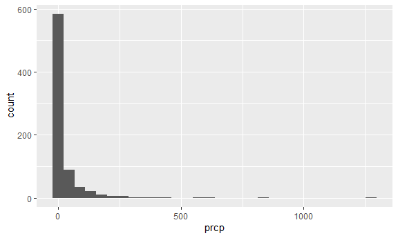
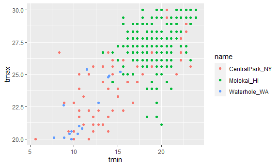
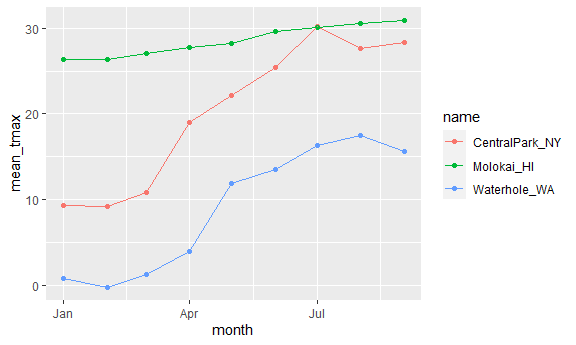

EDA: Numeric summaries
================
Sitian Zhou
2023-09-28

``` r
library(tidyverse)
```

    ## ── Attaching core tidyverse packages ──────────────────────── tidyverse 2.0.0 ──
    ## ✔ dplyr     1.1.3     ✔ readr     2.1.4
    ## ✔ forcats   1.0.0     ✔ stringr   1.5.0
    ## ✔ ggplot2   3.4.3     ✔ tibble    3.2.1
    ## ✔ lubridate 1.9.2     ✔ tidyr     1.3.0
    ## ✔ purrr     1.0.2     
    ## ── Conflicts ────────────────────────────────────────── tidyverse_conflicts() ──
    ## ✖ dplyr::filter() masks stats::filter()
    ## ✖ dplyr::lag()    masks stats::lag()
    ## ℹ Use the conflicted package (<http://conflicted.r-lib.org/>) to force all conflicts to become errors

``` r
library(patchwork)
#library(ggridges)

knitr::opts_chunk$set(
  fig.width = 6,
  fig.asp = .6,
  out.width = "90%"
)
```

``` r
weather_df = 
  rnoaa::meteo_pull_monitors(
    c("USW00094728", "USW00022534", "USS0023B17S"),
    var = c("PRCP", "TMIN", "TMAX"), 
    date_min = "2023-01-01",
    date_max = "2023-12-31") |>
  mutate(
    name = recode(
      id, 
      USW00094728 = "CentralPark_NY", 
      USW00022534 = "Molokai_HI",
      USS0023B17S = "Waterhole_WA"),
    tmin = tmin / 10,
    tmax = tmax / 10,
    month = lubridate::floor_date(date, unit = "month")) |>
  select(name, id, everything())
```

    ## using cached file: C:\Users\19840\AppData\Local/R/cache/R/rnoaa/noaa_ghcnd/USW00094728.dly

    ## date created (size, mb): 2023-09-06 21:37:09.150414 (8.54)

    ## file min/max dates: 1869-01-01 / 2023-09-30

    ## using cached file: C:\Users\19840\AppData\Local/R/cache/R/rnoaa/noaa_ghcnd/USW00022534.dly

    ## date created (size, mb): 2023-09-28 10:20:42.652794 (3.838)

    ## file min/max dates: 1949-10-01 / 2023-09-30

    ## using cached file: C:\Users\19840\AppData\Local/R/cache/R/rnoaa/noaa_ghcnd/USS0023B17S.dly

    ## date created (size, mb): 2023-09-06 21:37:26.890532 (0.996)

    ## file min/max dates: 1999-09-01 / 2023-09-30

## initial numeric work

``` r
weather_df |> 
  ggplot(aes(x = prcp)) +
  geom_histogram()
```

    ## `stat_bin()` using `bins = 30`. Pick better value with `binwidth`.

    ## Warning: Removed 57 rows containing non-finite values (`stat_bin()`).



Here are the big outliers

``` r
weather_df |> 
  filter(prcp > 1000)
```

    ## # A tibble: 1 × 7
    ##   name       id          date        prcp  tmax  tmin month     
    ##   <chr>      <chr>       <date>     <dbl> <dbl> <dbl> <date>    
    ## 1 Molokai_HI USW00022534 2023-01-28  1275  21.7  18.3 2023-01-01

``` r
weather_df |> 
  filter(tmax >= 20, tmax <= 30) |> 
  ggplot(aes(x = tmin, y = tmax, color = name)) +
  geom_point()
```



## Grouping - count \# of unique values

``` r
weather_df |> 
  group_by(name, month) |> 
  summarize(n_obs = n())
```

    ## `summarise()` has grouped output by 'name'. You can override using the
    ## `.groups` argument.

    ## # A tibble: 27 × 3
    ## # Groups:   name [3]
    ##    name           month      n_obs
    ##    <chr>          <date>     <int>
    ##  1 CentralPark_NY 2023-01-01    31
    ##  2 CentralPark_NY 2023-02-01    28
    ##  3 CentralPark_NY 2023-03-01    31
    ##  4 CentralPark_NY 2023-04-01    30
    ##  5 CentralPark_NY 2023-05-01    31
    ##  6 CentralPark_NY 2023-06-01    30
    ##  7 CentralPark_NY 2023-07-01    31
    ##  8 CentralPark_NY 2023-08-01    31
    ##  9 CentralPark_NY 2023-09-01    30
    ## 10 Molokai_HI     2023-01-01    31
    ## # ℹ 17 more rows

``` r
weather_df |> 
  group_by(month) |> 
  summarize(n_obs = n())
```

    ## # A tibble: 9 × 2
    ##   month      n_obs
    ##   <date>     <int>
    ## 1 2023-01-01    93
    ## 2 2023-02-01    84
    ## 3 2023-03-01    93
    ## 4 2023-04-01    90
    ## 5 2023-05-01    93
    ## 6 2023-06-01    90
    ## 7 2023-07-01    93
    ## 8 2023-08-01    93
    ## 9 2023-09-01    90

``` r
weather_df |> 
  count(name, name = "n_obs")
```

    ## # A tibble: 3 × 2
    ##   name           n_obs
    ##   <chr>          <int>
    ## 1 CentralPark_NY   273
    ## 2 Molokai_HI       273
    ## 3 Waterhole_WA     273

``` r
weather_df |> 
  count(name, month) |> 
  pivot_wider(
    names_from = name,
    values_from = n
  )
```

    ## # A tibble: 9 × 4
    ##   month      CentralPark_NY Molokai_HI Waterhole_WA
    ##   <date>              <int>      <int>        <int>
    ## 1 2023-01-01             31         31           31
    ## 2 2023-02-01             28         28           28
    ## 3 2023-03-01             31         31           31
    ## 4 2023-04-01             30         30           30
    ## 5 2023-05-01             31         31           31
    ## 6 2023-06-01             30         30           30
    ## 7 2023-07-01             31         31           31
    ## 8 2023-08-01             31         31           31
    ## 9 2023-09-01             30         30           30

# general summaries

``` r
weather_df |> 
  group_by(name, month) |> 
  summarize(
    mean_tmax = mean(tmax, na.rm = TRUE),
    median_tmax = median(tmax, na.rm = TRUE), 
    sd_tmax = sd(tmax, na.rm = TRUE)
  )
```

    ## `summarise()` has grouped output by 'name'. You can override using the
    ## `.groups` argument.

    ## # A tibble: 27 × 5
    ## # Groups:   name [3]
    ##    name           month      mean_tmax median_tmax sd_tmax
    ##    <chr>          <date>         <dbl>       <dbl>   <dbl>
    ##  1 CentralPark_NY 2023-01-01      9.29        9.4     3.84
    ##  2 CentralPark_NY 2023-02-01      9.21        9.15    5.61
    ##  3 CentralPark_NY 2023-03-01     10.8        10.6     3.88
    ##  4 CentralPark_NY 2023-04-01     19.0        18.4     5.84
    ##  5 CentralPark_NY 2023-05-01     22.1        22.8     4.35
    ##  6 CentralPark_NY 2023-06-01     25.4        25.6     2.97
    ##  7 CentralPark_NY 2023-07-01     30.2        30.6     2.05
    ##  8 CentralPark_NY 2023-08-01     27.6        27.2     2.13
    ##  9 CentralPark_NY 2023-09-01     28.3        28.6     3.63
    ## 10 Molokai_HI     2023-01-01     26.4        26.7     1.76
    ## # ℹ 17 more rows

``` r
weather_df |> 
  group_by(name, month) |> 
  summarize(mean_tmax = mean(tmax, na.rm = TRUE)) |> 
  ggplot(aes(x = month, y = mean_tmax, color = name)) +
  geom_point() +
  geom_line()
```

    ## `summarise()` has grouped output by 'name'. You can override using the
    ## `.groups` argument.



``` r
weather_df |> 
  group_by(name, month) |> 
  summarize(mean_tmax = mean(tmax, na.rm = TRUE)) |> 
  pivot_wider(
    names_from = name,
    values_from = mean_tmax
  ) |> 
  knitr::kable(digits = 2)
```

    ## `summarise()` has grouped output by 'name'. You can override using the
    ## `.groups` argument.

| month      | CentralPark_NY | Molokai_HI | Waterhole_WA |
|:-----------|---------------:|-----------:|-------------:|
| 2023-01-01 |           9.29 |      26.41 |         0.74 |
| 2023-02-01 |           9.21 |      26.37 |        -0.23 |
| 2023-03-01 |          10.83 |      27.00 |         1.24 |
| 2023-04-01 |          19.03 |      27.72 |         3.97 |
| 2023-05-01 |          22.10 |      28.17 |        11.89 |
| 2023-06-01 |          25.42 |      29.66 |        13.50 |
| 2023-07-01 |          30.20 |      30.05 |        16.34 |
| 2023-08-01 |          27.62 |      30.60 |        17.50 |
| 2023-09-01 |          28.32 |      30.89 |        15.62 |
